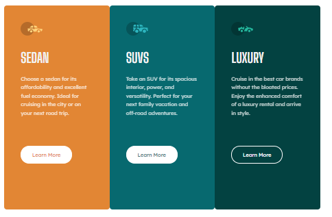
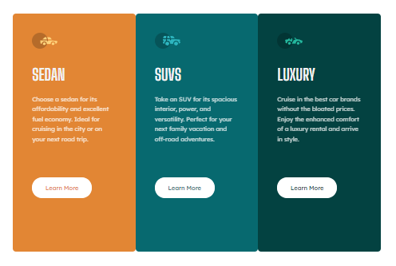

# Frontend Mentor - 3-column preview card component solution

This is a solution to the [3-column preview card component challenge on Frontend Mentor](https://www.frontendmentor.io/challenges/3column-preview-card-component-pH92eAR2-). Frontend Mentor challenges help you improve your coding skills by building realistic projects. 

## Table of contents

- [Overview](#overview)
  - [The challenge](#the-challenge)
  - [Screenshot](#screenshot)
  - [Links](#links)
- [My process](#my-process)
  - [Built with](#built-with)
  - [What I learned](#what-i-learned)
- [Author](#author)
- [Acknowledgments](#acknowledgments)

## Overview
In this challenge, I suppose to create the exact screen for both desktop and mobile view based on the challenge link.

### The challenge

Users should be able to:

- View the optimal layout depending on their device's screen size
- See hover states for interactive elements

### Screenshot

### Links

- [Solution URL here](https://github.com/neo2enigma/3-column-preview-card-component-main)
- [Live Site URL here](https://neo2enigma.github.io/3-column-preview-card-component-main/)

## My process
First I started to understand the layout and break each part to a section. It is essential to think modular in a way to prevent dublication in css. This mean you have pollute css file.
In the next step, I wrote HTML. For css part, I started from the very top element and finally reached to inner one.
The best way is to create the main structure and later on make yourself busy with decoration and color.

### Built with

- Semantic HTML5 markup
- CSS custom properties
- Flexbox
- Mobile-first workflow

### What I learned

I revised my css and HTML to times. I found that modular thinking and DRY pattern even in css are applicable.

## Author

- Linkedin - [@kamran-safaei](https://www.linkedin.com/in/kamran-safaei/)
- Frontend Mentor - [@devedoping](https://www.instagram.com/devedoping/)

## Acknowledgments

I appreciate my mentor; Erfan, helping me on this journey